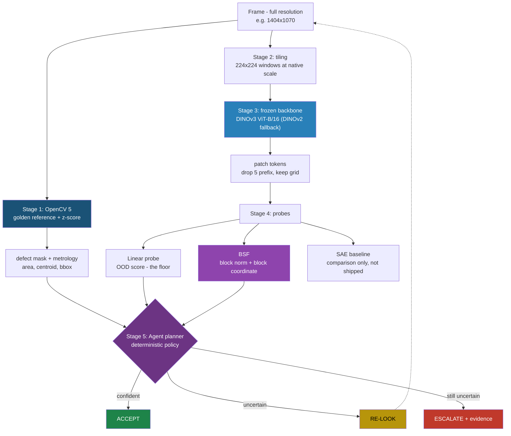

# Parallax — Engineering Architecture (as built)

*Living document. Last updated 2026-09-10.*

> `parallax_architecture.md` describes the system we are pitching. **This** document
> describes the system as it actually exists on disk today, what we measured, and why the
> design changed where it changed. Where the two disagree, this one is the ground truth for
> engineering; that one is the ground truth for the submission narrative.

---

## 1. What Parallax is, in plain terms

An industrial inspection system that **refuses to answer when it should not**.

Every competing entry detects defects. None of them detect **their own unreliability**,
which is the actual reason vision systems fail on a real production line: they meet
unfamiliar lighting, a new supplier's finish, an unexpected pose, and return a confident
verdict anyway.

Parallax produces two independent things for every frame:

| Product | Source | Question it answers |
|---|---|---|
| **Verdict** | OpenCV 5 geometry | "Is there a defect, where, and how big?" |
| **Confidence** | Frozen vision backbone + probe | "Is this frame like the ones I was validated on?" |

An agent combines them into one of three actions:

- **ACCEPT** — confident and in-distribution. Log it, advance.
- **RE-LOOK** — uncertain. Change something (crop, angle, exposure, threshold), re-run, re-score.
- **ESCALATE** — still uncertain after N attempts. Stop, hand to a human, attach the visual evidence.

**The number we are selling is not accuracy.** It is the escalation trade-off curve:
*"at a 99% accuracy floor, the system handles 78% of frames autonomously and escalates 22%."*
That converts the automate-everything / review-everything binary into a dial a QA manager
can actually set.

---

## 2. Where it runs

We have **no AWS account**. The system runs on hardware we own.

| Layer | Reality |
|---|---|
| Compute | **NVIDIA DGX-1, 8x Tesla V100 32 GB**, pipeline pinned to **one** GPU (`CUDA_VISIBLE_DEVICES=0`) |
| Access | SSH to a remote box (not yet provisioned as of this writing) |
| Dev machine | Windows laptop, RTX 4060 8 GB — **SM 8.9, so it cannot reproduce V100 constraints** |
| Cloud | AWS is a documented Phase-2 port, conditional on the compute grant. Nothing depends on it |

### The V100 constraints that shape the code

Volta is compute capability **SM 7.0**. Three consequences, all decided up front because
each is cheap now and expensive to discover on a remote box mid-run:

| Constraint | Why it bites | What we do |
|---|---|---|
| **No BF16** | Most published DINO inference code defaults to `bfloat16`, which Volta does not implement | `select_dtype()` reads device capability: fp16 on SM 7.0, bf16 on 8.0+ |
| **FlashAttention-2 needs SM 8.0+** | The standard ViT attention accelerator is Ampere-and-later only | PyTorch SDPA memory-efficient backend, which supports SM 7.0 |
| **One 32 GB card, shared box** | Backbone, featurizer and any planner model share a device | Fixed VRAM budget; planner is first evicted to host CPU |

> **Trap:** the dev laptop *does* support bf16 and FlashAttention. Code that works here can
> die on the DGX. Never hardcode a dtype.

---

## 3. Data

**VisA** (Visual Anomaly, Amazon Science) — CC BY 4.0, chosen over MVTec AD because
MVTec's CC BY-NC-SA terms conflict with the licence entrants grant the competition organisers.

| | |
|---|---|
| Archive | 1.8 GiB (`1,929,840,640` bytes exactly) |
| Images | **10,821** across 12 object classes |
| Train split | 8,659 — **normal only** (standard anomaly-detection setup) |
| Test split | 962 normal + **1,200 anomalous**, every anomaly with a pixel mask |
| Frame sizes | Vary **per class**: 1404×1070, 1562×960, 1358×1104, 1500×1000, 1284×1168 |

### Scope: rigid vs deformable

Golden-reference differencing assumes a rigid, near-planar part. We scope to that subset
and state the rest as a limitation rather than hiding it in an average.

| Scope | Classes | Count |
|---|---|---|
| **Rigid** (in scope) | `pcb1` `pcb2` `pcb3` `pcb4` `capsules` `candle` | 6,218 samples |
| **Deformable** (stated limitation) | `cashew` `chewinggum` `fryum` `pipe_fryum` `macaroni1` `macaroni2` | 4,603 samples |

> **Measured caveat:** `capsules` is nominally rigid but the capsules shift inside their
> tray. It separates at only 1.34× and scored 0.00 hit rate. It behaves like a deformable
> class and should probably be reported as one.

### Gotchas found the hard way

- The tar has **no wrapping `VisA/` directory** — the 12 class folders sit at the archive root.
- `split_csv/` ships **inside** the tar; the copy in the `spot-diff` GitHub repo is byte-identical (`9820ed0c…`), so no separate download is needed.
- Counting CSV rows **succeeds even when every path is wrong**. `visa.verify()` spot-checks files on disk because row counts are not evidence the dataset resolved.

---

## 4. The pipeline



---

### Stage 1 — OpenCV 5 verdict

**What it does:** builds a per-class golden reference from normal training frames, then
measures how far a new frame deviates.

A golden reference here is **not** one hand-picked perfect image. It is:

- a per-pixel **median** over ~80 normal frames — the expected appearance
- a per-pixel **MAD** (median absolute deviation) — how much that pixel *normally* varies

Deviation is then a robust **z-score**: `|frame - median| / MAD`. A pixel that always
varies a lot needs a big change to be suspicious; a pixel that never varies does not.

```
z = |gray(frame) - median| / max(MAD * 1.4826, MAD_FLOOR)
```

`MAD_FLOOR = 2.0` grey levels is not cosmetic. In flat regions MAD collapses toward zero
and the z-score explodes — background z reached **3665** on `candle` before the floor was
added.

**Why no image registration.** The docs originally called for warping each frame onto the
reference via homography. Measured on VisA, that made things **worse**:

| class | residual before | residual after warp | inlier ratio | corner shift |
|---|---|---|---|---|
| pcb1 | 34.85 | 26.24 | 0.22 | 1576 px |
| candle | 10.81 | **70.90** | 0.02 | 1279 px |
| capsules | 41.34 | 39.41 | 0.02 | 526 px |

VisA is captured on a **fixed rig**, so frames arrive near-registered. Estimating a
homography between two *different physical instances* of a part does not correct pose — it
invents one. LightGlue beat ORB (inlier 0.39 vs 0.22) but still did not help.

Alignment remains in `align.py` for the **live-capture path**, where the camera really moves.

**Bug this exposed:** `align_to_reference` was returning those garbage transforms as
*success*, because it only checked "≥4 matches, homography not None". It now rejects
transforms below `MIN_INLIER_RATIO = 0.25` or beyond 25% of the image diagonal in corner
displacement. A bad warp is worse than no answer — differencing an unregistered frame marks
the entire part defective.

---

### Stage 2 — Tiling (the non-obvious one)

**The problem.** VisA defects occupy 0.075%–0.78% of a frame. Resize a 1404×1070 image to
the backbone's 224 px input and the median defect becomes:

| class | defect @224 | in 14 px patches |
|---|---|---|
| pcb1 | 9.6 px | **0.69** |
| capsules | 6.1 px | **0.44** |
| candle | 9.1 px | **0.65** |
| pcb4 | 19.8 px | 1.41 |

**Smaller than a single patch.** There is no patch left to flag. Running the reference setup
naively would produce noise, and it would look like the featurizer was broken.

**The fix.** Crop 224×224 windows out of the frame **at native resolution** — no downscaling.
The same defect then covers 2–15 patches:

| class | frame | tiles | defect | patches |
|---|---|---|---|---|
| pcb1 | 1404×1070 | 63 | 39 px | 2.79 |
| pcb2 | 1404×1070 | 63 | 43 px | 3.07 |
| pcb3 | 1562×960 | 54 | 78 px | 5.59 |
| pcb4 | 1358×1104 | 56 | 204 px | 14.58 |
| capsules | 1500×1000 | 54 | 29 px | 2.07 |
| candle | 1284×1168 | 56 | 38 px | 2.70 |

This also **keeps the 224 px input size** that the BSF positional mean is computed for, so
compatibility survives. Cost: ~55–63 forward passes per frame instead of 1. Trivial on a V100.

Tiles overlap 25%; the last row and column sit flush with the far edge so no window is ever
partial. `stitch()` upsamples patch-resolution scores back to **source resolution**, averaging
overlaps — so score maps are directly comparable to ground-truth masks, and tile seams soften.

---

### Stage 3 — Frozen backbone

Nothing here is trained. It is a forward pass producing patch tokens.

| | DINOv3 ViT-B/16 (**default**) | DINOv2-with-registers (fallback) |
|---|---|---|
| model id | `facebook/dinov3-vitb16-pretrain-lvd1689m` | `facebook/dinov2-with-registers-base` |
| licence | Meta DINOv3 License, gated — **granted 2026-09-10** | Apache 2.0 |
| patch size | 16 | 14 |
| patches @224 | **196** | **256** |
| dim | 768 | 768 |
| prefix tokens | 5 (CLS + 4 registers) | 5 (CLS + 4 registers) |

All values verified against each published `config.json`, not assumed. Note `dinov2-with-registers-base` declares `image_size: 518`; we feed 224px tiles, so patch count must come from `n_patches(224)` and never from the config default.

**Why the register variant and not plain `dinov2-base`:** identical token layout to DINOv3
(so the swap is one line), and registers absorb the high-norm artefact tokens that would
otherwise appear in a patch map and read exactly like anomalies.

**Status:** DINOv3 access **granted 2026-09-10** (config and preprocessor both 200).
DINOv2-with-registers stays defined as the fallback and as a licence-clean comparison point.

#### Two normalisations, both required, in order

1. **Pixel** — the image processor applies ImageNet mean/std. Standard.
2. **Activation** — the BSF convention: subtract the per-patch-position mean, then scale so
   the mean squared activation norm equals `d`. The featurizers' sparsity thresholds assume it.

> **Resolved:** the shipped `pos_mean.npy` is `(196, 768)` — DINOv3 only — and DINOv3 is now
> the default, so it applies directly and no positional mean needs computing. If the project
> ever falls back to DINOv2 (256 patches) it must be recomputed from normal tiles.
> `centre_and_scale` raises on the mismatch, so a careless swap fails loudly.

---

### Stage 4 — Probes

Three heads on the **same** activations, so one extraction pass feeds all of them.

| Head | Role | Ships? |
|---|---|---|
| **Linear probe** | The floor. ~1 day, near-certain to work. Guarantees the agent loop has a confidence signal | Yes |
| **BSF** | Primary signal + the explanation surface | Yes |
| **SAE** | Baseline BSF is measured against | **No** — measuring stick only |

**Block-Sparse Featurizer** (`vendor/block-sparse-featurizer`, MIT, pinned `219f121e`) gives
two quantities per concept where an SAE gives one:

- **Block norm** `‖z_g‖` — *how strongly* a concept is present
- **Block coordinate** `z_g` — *where within* that concept the activation sits

For inspection that is the difference between "this resembles a weld seam" and "this is the
cracked end of the weld-seam manifold". The second is what an operator can act on.

Three variants share one interface (`bsf.BSF`), one trainer, one visualiser, so comparing
them costs a constructor argument:

| Variant | Sparsity mechanism |
|---|---|
| `VanillaBSF` | Block TopK — keep the `l0` largest-norm blocks |
| `GrassmannianBSF` | Block TopK, orthonormal frames (**our starting point**) |
| `GroupLassoBSF` | Block JumpReLU gate, θ learned by straight-through estimator |

`group_size=3` is principled, not arbitrary: the paper's MDL analysis finds recovered
concepts are typically **2–4 dimensional**. We sweep {2, 3, 4}.

**The result that justifies the whole design:** the BSF paper recovers **shadow and lighting
manifolds** from DINO features. Illumination is the canonical way a golden-reference pipeline
produces a false defect — so the confidence signal is aimed at a nuisance variable the method
is *known* to represent, not a hoped-for generalisation.

**Why the SAE is a baseline and not a component:** the companion paper shows SAEs recover
continuous structure suboptimally, fragmenting a manifold across atoms in a regime the authors
call **dilution**. So no single SAE feature answers "is this lighting familiar?". We measure
this rather than assert it, using `vendor/sae-manifold` (MIT, pinned `f2632ddb`).

> **Caveat:** `sae-manifold` targets Llama-3.1-8B with text-prompt manifolds. What transfers
> is the `BatchTopKSAE` class and the metric *definition* — not the data pipeline. Budget it
> as porting a metric, not installing a tool.

---

### Stage 5 — Agent planner

With no Bedrock in the local path, the decision authority is an explicit, versioned policy
over `(verdict, OOD score, block norms, retry count)` — deterministic, unit-testable, and
replayable from the trace log. An optional local open-weights LLM writes the human-readable
rationale attached to an escalation.

This is a **strengthening, not a downgrade**: "appropriate autonomy" is easier to evidence
when the gate is a reviewable function than when it is a sampled model output. The agent may
re-look freely but may **never** override a block — human approval is a hard gate.

---

## 5. Measured results so far

Everything below is from real VisA data, not estimates.

### OpenCV baseline (Stage 1 alone, no learned component)

| class | hit rate | IoU | z at defect | z background | normal px flagged |
|---|---|---|---|---|---|
| pcb1 | 0.28 | 0.031 | 5.37 | 1.38 | 3.2% |
| pcb2 | 0.10 | 0.024 | 3.57 | 1.71 | 2.6% |
| pcb3 | 0.17 | 0.058 | 4.41 | 1.41 | 2.8% |
| pcb4 | 0.28 | 0.050 | 2.10 | 0.89 | 2.3% |
| capsules | 0.00 | 0.000 | 1.51 | 0.96 | 1.1% |
| candle | 0.10 | 0.010 | 8.99 | 1.80 | 2.7% |

**Read this correctly.** Hit rate is scored against the **single largest blob** — the region
a real verdict would report. An earlier "any flagged pixel touches the mask" metric scored
~1.00 and was meaningless, because the threshold already flags 2–3% of a 1.5 M-pixel frame.

**This is the expected starting point, not a failure.** Pixel differencing being weak on
subtle defects is the premise of the project — it is why the confidence probe exists. The
number's job is to be the comparison row in the report.

**What it does *not* mean:** the probe cannot rescue localisation. The probe answers "should
you trust this verdict?", not "where is the defect?". Which half of the system does the
detecting is still an open question, to be settled by measurement once Stage 3 exists.

### Alignment: ORB vs LightGlue (synthetic, controlled)

| condition | ORB | LightGlue |
|---|---|---|
| pose only | 767 matches, 0.76 inlier | 692 matches, **1.00** |
| pose + hard shadow | 404 matches, 0.75 | **702 matches, 1.00** |

ORB loses 47% of its correspondences under a shadow; LightGlue does not move. **But both end
at an identical 18.0 post-alignment residual** — the shadow is genuine image difference, so
better geometry cannot separate shadow from defect. That is the project thesis in one number,
and it is pinned as a test.

### Differencing sensitivity to illumination

CLAHE normalisation absorbs a **±15% gain**. At ×1.30 it produces **36 false defects**; a
clipping `+40` offset produces 22. Encoded as a test asserting strong lighting change *must*
be misread — so nobody can quietly tune away the boundary the probe exists to cover.

---

## 6. Code map

```
src/parallax/
  compliance.py   OpenCV 5 version banner + hard assert (CI log, demo video)
  visa.py         download -> extract -> index -> verify. Rigid/deformable scope
  align.py        ORB and LightGlue registration, with plausibility gating
  reference.py    Golden reference: median + MAD, z-score, save/load
  inspect.py      absdiff -> threshold -> morphology -> contours -> metrology
  tiling.py       plan_tiles / cut / stitch — native-resolution windows
  backbone.py     BackboneSpec, dtype selection, BSF activation convention
  models.py       ONNX weights, SHA-1 verified, from OpenCV's own manifest

scripts/
  build_references.py   Build + score references per rigid class

tests/            74 tests
vendor/           block-sparse-featurizer @219f121e, sae-manifold @f2632ddb (submodules)
papers/           Both source papers, CC BY 4.0, with attribution
data/             gitignored: VisA, ONNX models, references
```

### External dependencies, pinned

| What | Where | Pin |
|---|---|---|
| OpenCV | `opencv-python` | `5.0.0.93` |
| ALIKED ONNX | `YangGuanyuhan/lightglue_opencv_project` | sha1 `41faa7bf…` |
| ALIKED-LightGlue ONNX | same | sha1 `02723aa5…` |
| DISK ONNX | `fabio-sim/LightGlue-ONNX` v0.1.0 | sha1 `5f6a9069…` |
| BSF | `goodfire-ai/block-sparse-featurizer` | `219f121e` |
| SAE baseline | `goodfire-ai/sae-manifold` | `f2632ddb` |

> OpenCV ships the ALIKED/DISK/LightGlue **code** but not the **weights**, and they are not
> in `opencv_zoo` (checked all 25 models). The URLs above come from OpenCV's own test
> manifest, so these are the exact artifacts the library is tested against. `models.py`
> verifies SHA-1 on every fetch and deletes a model that fails.

---

## 7. Build order and status

| # | Step | Status |
|---|---|---|
| 1 | Project scaffold, OpenCV 5 compliance | **done** |
| 2 | VisA ingest + verification | **done** |
| 3 | Golden reference + OpenCV baseline measured | **done** |
| 4 | Tiling + backbone config | **done** (forward pass is a thin seam) |
| 5 | Feature extraction on the DGX | **blocked — needs SSH** |
| 6 | Linear probe (the floor) | pending 5 |
| 7 | Positional mean | **not needed** — shipped file fits DINOv3 |
| 8 | BSF training + SAE baseline comparison | pending 6, 7 |
| 9 | Agent loop (policy engine + traces) | pending 6 |
| 10 | Escalation UI with BSF evidence | pending 8 |
| 11 | Evaluation sweep + escalation curve | pending 9 |

**Nothing is trained yet.** Steps 1–4 are classical CV, statistics, and plumbing.

---

## 8. Open items

**Blocking**
- SSH access to the DGX
- ~~DINOv3 gate approval~~ — **granted 2026-09-10**

**Decisions not yet made**
- Whether OpenCV or the backbone is credited with *localisation* in the write-up. To be settled by measurement, not argument
- Whether `capsules` moves to the stated-limitations list
- Per-class z-thresholds and a defect-size prior, instead of one global z = 4

**Known risks**
- The dev laptop cannot reproduce V100 constraints; first real fp16/SDPA validation happens on the DGX
- BSF beating the linear probe on OOD separation is a genuine bet. If it loses, it stays for the explanation surface and the negative result is reported

---

## 9. Glossary

| Term | Meaning |
|---|---|
| **OOD** | Out of distribution — input unlike anything the system was validated on |
| **Patch token** | One ViT feature vector for one 14×14 or 16×16 image square |
| **Register token** | Extra non-image tokens that absorb high-norm artefacts, keeping patch maps clean |
| **MAD** | Median absolute deviation — outlier-robust spread |
| **z-score** | Deviation measured in units of normal variation, not raw grey levels |
| **SAE** | Sparse autoencoder — decomposes activations into sparse **directions** |
| **BSF** | Block-Sparse Featurizer — decomposes into **blocks** (subspaces), so a concept has an internal coordinate |
| **Dilution** | An SAE fragmenting one manifold across many atoms, so no single feature represents it |
| **IoU** | Intersection over union — overlap between predicted and true defect regions |
| **Golden reference** | Expected appearance of a good part; here median + MAD, not one image |
