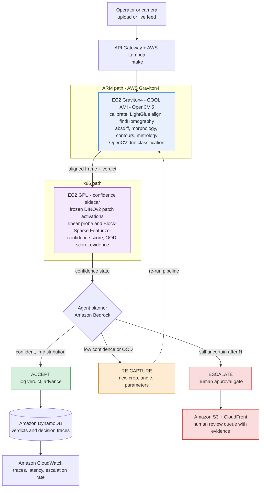

# AWS Cloud Compute Grant Application — Parallax

**OpenCV AI Competition 2026, powered by AWS**
Cloud Compute Grant Proposal — submitted by Team Parallax, September 2026

## At a Glance

- **What we are building** — Parallax, a cloud inspection service that refuses to answer when it should not. OpenCV 5 does the geometry; an interpretability probe scores whether that result can be trusted; an agent then accepts, re-looks, or escalates to a human.
- **Why it is different** — most vision systems detect defects. None detect their own unreliability, which is the actual reason they fail to ship.
- **OpenCV 5 role** — calibration, LightGlue alignment, homography, differencing, morphology, contour metrology. Irreducible geometric work, not preprocessing around a model call.
- **AWS footprint** — Graviton4 with COOL on the Arm path, x86 for backbone inference, Bedrock for orchestration, DynamoDB and CloudWatch for audit and observability.
- **Featured paths** — both. Agentic Vision as the primary path, Best Use of COOL as a documented hybrid.
- **Headline metric** — the escalation trade-off curve: at a given accuracy floor, what fraction of frames the system handles autonomously.
- **Team** — 2 people, 7-week build, every component owned.

---

## 1. Team Name

**Parallax**

| Role | Name | Contact |
|---|---|---|
| Team representative | Aditya Kumar | vasudeo118@gmail.com |
| Team member | Saumilya Gupta | saumilya.ai@gmail.com |

Team size: 2. The team representative is authorized to submit the entry and to receive notices and prizes on
the team's behalf.

---

## 2. Problem Statement and Intended Real-World Impact

Automated visual inspection does not fail in production because models cannot find defects. It fails because
models cannot tell you when to stop trusting them. A deployed system meets lighting it was never trained under,
a part pose nobody anticipated, or a new supplier's surface finish, and it returns a confident verdict anyway.
Teams respond by routing everything to human review, which destroys the economics, or routing nothing, which
ships defects.

**Parallax** is an inspection service built around the missing piece: a cheap, real-time, trustworthy signal
for when a perception result is out-of-distribution, and an agent that acts on that signal rather than narrating
it. OpenCV 5 performs the geometry and metrology. A frozen vision backbone with a lightweight interpretability
probe scores how far each frame sits from the distribution the system was validated on. That score decides what
happens next: accept the verdict, re-capture the scene and re-analyse it, or stop and escalate to a human with
the visual evidence attached.

**Impact.** A calibrated escalation policy converts the automate-everything / review-everything binary into a
dial. The operator sets an accuracy floor; the system reports what fraction of frames it can handle autonomously
at that floor. We will publish that trade-off curve as our headline result, because it is the number a quality
manager actually buys. The same architecture — perception, measured confidence, bounded autonomy, human gate —
transfers to medical imaging triage, infrastructure inspection, and any safety-adjacent vision deployment where
being quietly wrong is worse than being slow.

**Responsible use.** The system is designed to reduce unwarranted automation. It never hides an uncertain result
behind a confident summary, it blocks rather than guesses when the probe flags out-of-distribution input, and
every autonomous verdict is logged with the evidence that produced it. Failure cases, including defects the
probe was confidently wrong about, are reported as a first-class section of our technical report.

---

## 3. Planned OpenCV 5 Image or Video Analysis

OpenCV 5 performs the substantive perception work; it is not preprocessing around a model call. Module names
follow the OpenCV 5 reorganization, in which `calib3d` was split into `geometry` / `calib` / `stereo` and
`features2d` was renamed `features`.

| Stage | OpenCV 5 modules |
|---|---|
| Calibration | `calib` — `calibrateCamera`; `imgproc` — `undistort` |
| Feature extraction | `features` — ORB/SIFT plus ALIKED / DISK learned local features |
| Reference alignment | `features` — LightGlue matcher; `geometry` — `findHomography` (RANSAC); `imgproc` — `warpPerspective` |
| Change isolation | `core` — `absdiff`; `imgproc` — adaptive threshold, CLAHE |
| Defect segmentation | `imgproc` — `morphologyEx`, `findContours`, `connectedComponentsWithStats` |
| Metrology | `imgproc` — `contourArea`, `minAreaRect`, `arcLength` |
| Classification | `dnn` — ONNX inference on candidate regions |
| Video path | `video` — `calcOpticalFlowFarneback`, background subtraction |

**The OpenCV 5 dependency is functional, not nominal.** Our alignment stage uses LightGlue with ALIKED/DISK
features, which are introduced in OpenCV 5 and unavailable in 4.x. We benchmark this against classical
ORB + BFMatcher alignment and report both. The runtime version banner appears in our demo video and CI log.

**Dataset.** VisA (Visual Anomaly, Amazon Science) — 10,821 high-resolution images, 12 object classes,
pixel-level anomaly annotations, released under CC BY 4.0. We chose VisA because its permissive licence is
compatible with the licence participants grant OpenCV and AWS over submitted materials; we deliberately avoided
MVTec AD, whose CC BY-NC-SA terms conflict with that grant.

**Stated scope limits.** VisA ships no camera intrinsics, so on the dataset we convert pixels to millimetres via
a known reference dimension per part class, and reserve full intrinsic calibration for the live-capture demo
path. Homography-to-golden-reference assumes rigid, near-planar parts: we scope align-and-difference to VisA's
structured classes (`pcb1`-`pcb4`, `capsules`, `candle`) and treat the deformable food classes (`cashew`,
`chewinggum`, `fryum`, `pipe_fryum`, `macaroni1`, `macaroni2`) as a stated limitation handled by the
classification path and probe alone.

---

## 4. Planned AWS Architecture and Services

**Services:** Amazon EC2 (Graviton4 and x86), Amazon Bedrock, AWS Lambda, Amazon API Gateway, Amazon S3,
Amazon DynamoDB, Amazon CloudWatch, AWS IAM, Amazon CloudFront.

**Documented hybrid architecture.** The OpenCV 5 workload runs on **AWS Graviton4 under the Cloud Optimized
OpenCV Library (COOL)**; frozen-backbone inference runs on x86. This is the hybrid arrangement the Best Use of
COOL rules permit, with COOL executing the claimed core image workload on the Arm component.

- **Intake** — API Gateway + Lambda receive a frame and part class; artifacts land in S3.
- **Perception (Arm)** — EC2 Graviton4 on the COOL AMI runs the full OpenCV 5 pipeline.
- **Confidence (x86)** — EC2 GPU instance runs the frozen DINOv2 backbone and probe sidecar.
- **Orchestration** — Amazon Bedrock hosts the planner that selects accept / re-capture / escalate.
- **State and audit** — DynamoDB stores verdicts and full decision traces; CloudWatch carries structured
  traces, latency, and escalation-rate dashboards.
- **Human review** — a static queue on S3 + CloudFront showing each escalation with its visual evidence.
- **Security** — per-component least-privilege IAM roles; no shared credentials.

**Cost discipline and credit use.** We will not run an always-on GPU endpoint. The intake path and review queue
stay warm on Lambda, S3, and CloudFront at negligible cost; Graviton and x86 pipeline instances start on demand
for evaluation runs and the judge demonstration. AWS Free Tier credits plus the requested compute grant are
budgeted primarily against Graviton benchmarking hours and Bedrock planner calls during the evaluation phase,
which is where our spend concentrates. We understand promotional credits are non-transferable, apply only to
eligible AWS services, and are subject to Free Tier terms and expiration.

---

## 5. High-Level Architecture Diagram

**The loop in one sentence:** OpenCV 5 produces a verdict, the probe scores whether that verdict can be trusted,
and that score — not a language model's self-assessment — determines whether the system accepts, looks again, or
stops and asks a human.

---

## 6. Target Users and Beneficiaries

- **Primary — manufacturing QA engineers** at small and mid-sized producers who cannot fund a bespoke machine
  vision integration and who need a system whose autonomy they can tune against a stated accuracy floor.
- **Secondary — line operators** receiving escalations. Their experience is the real UX: a short, ranked queue
  of genuinely ambiguous cases, each carrying the visual evidence that triggered it, rather than a firehose of
  low-confidence alerts.
- **Tertiary — quality and compliance auditors**, who gain a replayable trace for every autonomous verdict,
  including which frames the system declined to judge and why.
- **Beyond manufacturing** — the escalation architecture is domain-agnostic. We will document what transferring
  it to another inspection domain requires.

---

## 7. Proposed Evaluation Method and Judge Demonstration

**Evaluation is designed in from week one, not appended at the end.**

1. **Detection quality** — precision, recall, F1, pixel-level AUROC on VisA held-out splits, with and without the
   confidence gate; reported per class and split by rigid versus deformable subset, never as a single average
   that would obscure where reference alignment does not apply.
2. **Escalation trade-off curve (headline result)** — fraction of frames auto-accepted versus accuracy within
   the auto-accepted set, swept across confidence thresholds.
3. **Distribution-shift robustness** — probes trained on synthetic and augmented defects, evaluated on real VisA
   anomalies.
4. **Ablation** — probe-gated escalation versus raw classifier softmax versus no re-look, isolating how much
   gain comes from the confidence signal rather than from re-capturing.
5. **Agent task success** — how often a re-look corrects an initially wrong verdict, and the over-escalation
   cost of cases it should have handled.
6. **Cost comparison** — probe sidecar versus a VLM-as-judge baseline, per 1,000 frames, in dollars and latency.
7. **COOL performance** — latency, throughput, and cost per 1,000 frames on Graviton4 with COOL against a stock
   OpenCV 5 baseline, with instance types, COOL version, inputs, and method published for reproduction.
8. **Failure gallery** — defect classes handled poorly and cases where the probe was confidently wrong.

**Judge demonstration.** A judge-accessible web endpoint where a judge uploads or selects a frame — including
deliberately out-of-distribution frames we provide — and watches the loop run live: OpenCV 5 verdict, confidence
score, the agent's chosen action, the re-look, the changed verdict, and where triggered the escalation with its
evidence. The decision trace is visible in the UI. We will additionally offer a live screen-share walkthrough.
The repository ships pinned dependencies, infrastructure-as-code, a one-command deploy, and tests; we will
rehearse a clean clone-and-deploy from scratch before submitting.

**Licensing of everything we ship:** VisA (CC BY 4.0), DINOv2 (Apache 2.0), Block-Sparse Featurizer (MIT),
OpenCV 5 (Apache 2.0), COOL via AWS Marketplace under its listing terms.

---

## 8. Featured Path Declaration

**Both paths.**

**Agentic Vision (primary).** OpenCV 5 output is the control input to the planner, not a result the agent
merely describes. We will submit the agent workflow diagram covering perception, decision, and action, plus
recorded traces demonstrating that a change in the OpenCV 5 result changes a subsequent tool call, together with
our evaluation of task success, failure handling, observability, and the human approval gate. Autonomy is
bounded by construction: the agent may re-capture and re-parameterise freely, but may never override a block or
pass a part while the probe reports out-of-distribution.

**Best Use of COOL (secondary).** COOL executes the core image workload on AWS Graviton4, the Arm component of
our documented hybrid architecture. We will submit the COOL version and instance configuration, a reproducible
benchmark method with inputs and baselines, and evidence that COOL is executing the claimed workload rather than
merely being installed.

---

## 9. Team Bio

**Team size: 2.** Every component below has a named owner; nothing is unassigned.

**Aditya Kumar — Perception and cloud infrastructure**
Owns the OpenCV 5 pipeline (calibration, LightGlue alignment, differencing, segmentation, metrology), the
Graviton4 / COOL deployment and benchmark, and the AWS infrastructure and observability.
*`[Background to be completed: CV / systems / cloud experience, education or employment; prior hackathons and competitions with results.]`*

**Saumilya Gupta — Confidence sidecar, agent, and evaluation**
Owns the frozen DINOv2 backbone and probe sidecar (linear probe and Block-Sparse Featurizer), the Bedrock
planner and escalation logic, the evaluation suite, and the technical report.
*`[Background to be completed: ML / interpretability / evaluation experience; prior hackathons and competitions with results.]`*

**Shared:** the human review UI, the five-minute video, and reproducibility (pinned dependencies,
one-command deploy, clean-clone rehearsal).

**Scope realism at this team size.** Two people over seven weeks is the constraint we have planned against, and
our schedule reflects it: the highest-risk work (activation extraction and probes) sits in week 2, deliberately
early. If the schedule slips, the **COOL benchmark is what we cut** — it is the most separable component and the
Overall award requires neither featured path. The Agentic Vision loop is not cut, because it is the project.
