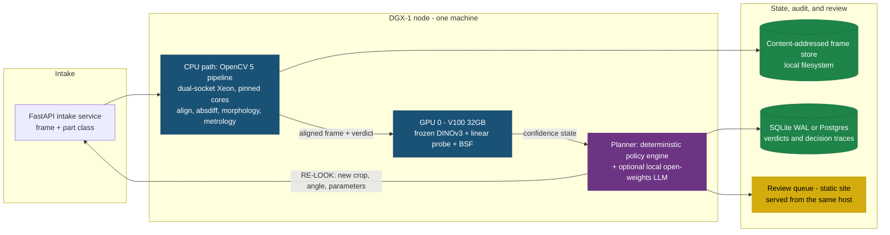

# Parallax: Technical Architecture & Real-World Example

To understand what we are building, let's walk through a concrete, real-world example of the system in action on a manufacturing line, followed by the technical flows that make it happen.

## 1. A Real-World Example: The Circuit Board Inspection

Imagine a manufacturing line producing Printed Circuit Boards (PCBs). The QA goal is to catch missing components or solder defects. 

**The Setup:**
The Parallax system is installed above the conveyor belt. It has a "golden reference" image of a perfect PCB. 

**Scenario A: The Perfect Board (In-Distribution, High Confidence)**
1. A good PCB slides under the camera.
2. **OpenCV 5 (CPU path):** Aligns the image to the golden reference, subtracts the differences, and finds no defects.
3. **DINOv3 Sidecar (GPU 0):** Looks at the image and says, "This looks exactly like the lighting and angles I was trained on. I am 98% confident."
4. **Agent Planner:** Sees `No Defects` + `High Confidence` -> **Action: ACCEPT**. The board moves on.

**Scenario B: The Tricky Shadow (Out-of-Distribution, Low Confidence)**
1. A PCB slides under, but a warehouse door opened, casting a harsh, unfamiliar shadow over a cluster of resistors.
2. **OpenCV 5:** The shadow causes a pixel difference. OpenCV flags it as a "Defect" because it looks different from the golden reference.
3. **DINOv3 Sidecar:** Analyzes the patch activations and realizes, "I have never seen this lighting distribution before. My confidence in this region is 30%."
   *This is not an aspiration: shadow and lighting manifolds are among the structures the BSF paper reports
   recovering from DINO features — see Section 4C.*
4. **Agent Planner:** Sees `Defect` + `Low Confidence` -> **Action: RE-LOOK**. 
5. The Agent adjusts the camera exposure parameters (or requests a second crop at a different angle) and takes a new frame.
6. **Re-Evaluation:** The new frame removes the shadow. OpenCV finds no defects, and DINOv3 confidence is high. The board is accepted without wasting a human's time.

**Scenario C: The Unsolvable Defect (Escalation)**
1. A PCB has a weird, smeared solder paste blob that looks ambiguous. 
2. OpenCV flags it. DINOv3 confidence is extremely low because it's an edge case.
3. The Agent tries a "Re-look", but the confidence remains low.
4. **Agent Planner:** **Action: ESCALATE.**
5. **Human Operator:** Receives a ping on their dashboard. They don't just get a warning; they get the image with a bounding box drawn exactly over the smeared solder, with the BSF (Block-Sparse Featurizer) explaining *why* it's confused. The human clicks "Reject".

---

## 2. Technical User Flow (The Agentic Loop)

This diagram shows how a single frame is processed and how the agent makes decisions based on the dual-output of the system.


---

## 3. System Architecture (Local GPU Deployment)

Parallax runs on hardware we already own: a single **NVIDIA DGX-1 node with 8x Tesla V100 32 GB**, of which the
pipeline is pinned to **one GPU**. Perception, confidence, planning, audit, and the human review queue all
execute on that one machine. There is no cloud dependency in the critical path. The AWS deployment in Section 3b
is a **port, not a prerequisite** — it is what the compute grant funds, and the project ships without it.

**Why deliberately one GPU.** The DGX is a shared box, so pinning to `CUDA_VISIBLE_DEVICES=0` leaves the other
seven cards free for other tenants. It also forces the throughput claim to hold on a single-accelerator budget,
which is the realistic configuration for a factory edge box. A pipeline that needs eight V100s does not deploy
on a production line.



### Technical Breakdown

| Component | Role | Runs on | Cloud equivalent (Section 3b) |
|---|---|---|---|
| **The Muscle** | Homography alignment (LightGlue/ALIKED), differencing, morphological ops, contour metrology | DGX host CPUs, pinned core set | EC2 Graviton4 + COOL |
| **The Brain** | Frozen DINOv3 inference, Linear Probe, BSF confidence scoring | V100 32 GB, GPU 0 only | EC2 x86 GPU instance |
| **The Conductor** | Takes OpenCV verdict + confidence state, decides ACCEPT / RE-LOOK / ESCALATE | Policy engine on host CPU; optional local LLM on GPU 0 | Amazon Bedrock |
| **The Memory** | Replayable decision traces for every verdict | SQLite in WAL mode (Postgres if concurrency demands it) | DynamoDB |
| **The Human Gate** | Escalation queue with BSF-powered visual evidence | Static site served by the intake process | S3 + CloudFront |
| **The Frame Store** | Frames, golden references, defect masks, model artifacts | Local filesystem, content-addressed by SHA-256 | S3 |
| **Observability** | Structured traces, latency, escalation rate | JSONL event log + Prometheus/Grafana on the host | CloudWatch |

**The planner is a policy engine, not a prompt.** With Bedrock out of the local path, the decision authority
becomes an explicit, versioned policy over `(verdict, OOD score, block norms, retry count)` — deterministic,
unit-testable, and replayable from the trace log. A local open-weights LLM is optional and confined to writing
the human-readable rationale attached to an escalation. This is a strengthening, not a downgrade: the rubric
line on *appropriate autonomy* is easier to evidence when the gate is a reviewable function than when it is a
sampled model output.

### V100-specific constraints, decided before any code is written

Volta is compute capability **SM 7.0**, and three consequences follow that are cheap to handle up front and
expensive to discover in week 5:

| Constraint | Why it bites | What we do |
|---|---|---|
| **No BF16 on Volta** | Most published DINOv3 inference code defaults to `bfloat16`, which Volta does not implement — depending on the op that either throws or silently degrades | Run autocast in **`float16`** explicitly, with an fp32 master copy for the probe head |
| **FlashAttention-2 requires SM 8.0+** | The standard attention accelerator for ViTs is Ampere-and-later only; installing it on this box buys nothing | Use PyTorch **SDPA with the memory-efficient backend**, which does support SM 7.0 |
| **Pinned to one 32 GB card** | DINOv3, the BSF, and any local planner model share a single device | Fixed VRAM budget below, with the planner as the first thing evicted to CPU |

**Toolchain pin.** `sm_70` kernels must be present in whatever PyTorch/CUDA build we install; newer stacks
progressively drop older architectures. The build combination is pinned in the lockfile and asserted at startup
by a check on `torch.cuda.get_device_capability()`, so a silent CPU fallback cannot masquerade as a slow GPU.

### VRAM budget, single V100 (32 GB)

| Resident | Estimate (fp16) |
|---|---|
| Frozen DINOv3 ViT-L/14 weights | ~0.6 GB |
| Activation working set, batched inference | ~2-4 GB |
| Block-Sparse Featurizer (dictionary + block coordinates) | ~0.5-1.5 GB |
| Optional local planner LLM (7B class, incl. KV cache) | ~15-16 GB |
| **Total** | **~19-22 GB of 32 GB** |

These are sizing figures, **not measurements** — measured throughput and memory are a week-2 deliverable and are
reported as such. The headroom is deliberate: if the planner model crowds the card it moves to the host CPUs, or
drops to a smaller quantized model, and nothing else in the stack has to change.

### What running locally costs us, stated plainly

- **No Arm path, so no COOL benchmark locally.** COOL exists only for Graviton, which exists only on AWS. The
  Best Use of COOL deliverable is therefore **entirely contained in Section 3b** and is conditional on the
  compute grant. Everything that scores on the Overall and Agentic Vision rubrics runs without it.
- **The hybrid split is CPU/GPU here, Arm/x86 there.** Locally the separation is still real — classical geometry
  on cores, learned features on the accelerator — but it is not the Arm/x86 hybrid the COOL rules describe, and
  we do not describe it as one.
- **Managed services become local ones.** DynamoDB becomes SQLite, S3 becomes a content-addressed directory,
  CloudWatch becomes a JSONL event stream. The **trace schema is identical in both deployments**, so the audit
  and replay tooling is written once and the cloud port is a storage-adapter swap rather than a rewrite.

---

## 3b. Cloud Port (Phase 2 — conditional on the AWS compute grant)

This is the target architecture if the grant lands, and the only configuration in which the Best Use of COOL
path is live. It is not on the critical path for the Overall or Agentic Vision submissions.


**What the port actually changes.** Because the local build is written against storage and planner interfaces
rather than against SQLite and the filesystem directly, the port is bounded:

| Local | Cloud | Port surface |
|---|---|---|
| FastAPI intake | API Gateway + Lambda | Handler wrapper; same request schema |
| OpenCV 5 on Xeon cores | EC2 Graviton4 on the COOL AMI | Recompile for Arm; this **is** the COOL benchmark deliverable |
| DINOv3 + probe on V100 | EC2 x86 GPU instance | Container moves as-is; Ampere-class hardware also lifts the fp16 and FlashAttention constraints above |
| Policy engine (+ optional local LLM) | Amazon Bedrock planner | Same policy, different rationale generator |
| SQLite WAL | DynamoDB | Storage adapter behind the trace interface |
| Local filesystem store | S3 | Storage adapter |
| JSONL + Prometheus | CloudWatch | Log shipper |
| Static site on host | S3 + CloudFront | Same static bundle |

**Grant credits therefore fund the Arm benchmark and the managed-services port, not baseline development.**
Model training, probe fitting, the full VisA evaluation sweep, and the agent loop all run on hardware we own at
zero marginal cost. That is the honest cost story, and a stronger one than asking for credits to do the basic
work.

---

## 4. Technical Deep Dive: The Confidence Sidecar

The "Confidence Sidecar" is what allows the system to know *when* it is confused. It operates entirely separately from OpenCV's geometry processing. Here is exactly how it works under the hood.

### A. The Backbone: DINOv3

When a frame comes in, it is passed through a **frozen DINOv3 vision transformer**. 

- We do **not** train or fine-tune DINOv3.
- We chop the image into 14x14 pixel "patches" and extract internal activations (embeddings) from the transformer layers. 
- These activations contain rich, uncompressed representations of what's in the image.

> Think of DINOv3 as a universal feature extractor. It sees the raw pixels and converts them into a rich numerical fingerprint that captures texture, shape, edges, and structure — without being told what to look for.

### B. The Linear Probe (The Floor)

A simple linear classifier trained directly on those DINOv3 activations using our validated training data.

| Property | Detail |
|---|---|
| **Input** | DINOv3 activation vector (768-dim or 1024-dim) |
| **Output** | Single scalar: OOD likelihood score (0.0 to 1.0) |
| **Training** | Logistic regression on "good" vs "anomalous" activations from VisA |
| **Build time** | ~1 day |
| **Purpose** | Guaranteed working confidence signal from Week 2 |

**How it decides:** If the activation vector lands far from the cluster of "known good" activations in the training set, the probe returns a high OOD score. The agent interprets a high OOD score as "don't trust the OpenCV verdict."

### C. The Block-Sparse Featurizer / BSF (The Magic)

We train a **Block-Sparse Featurizer (BSF)** on the same DINOv3 activations, using Goodfire's reference
implementation directly rather than reimplementing it.

| | |
|---|---|
| **Repository** | <https://github.com/goodfire-ai/block-sparse-featurizer> |
| **Paper** | Fel, Kowal, Jacobs, Hazra, Bhalla et al., *Structuring Sparsity: Block-Sparse Featurizers Capture Visual Concept Manifolds*, arXiv:2606.25234 (23 Jun 2026) — <https://arxiv.org/abs/2606.25234> |
| **Licence** | MIT |
| **Pinned commit** | `219f121ea82d2b19200d1dac918396e6058d7eb9` (2026-08-17) |
| **Install** | from git at that SHA; the package is `bsf`, `requires-python >= 3.10` |
| **Dependencies** | `torch`, `numpy`, `scikit-learn`, `matplotlib`, `einops`, `transformers` — all unpinned upstream, so we pin them ourselves (see the `sm_70` note in Section 3) |

**We pin a commit rather than track `main`.** The repository ships training code, not pretrained featurizers,
so the code path is part of our result and has to be reproducible by a judge.

#### What the BSF paper establishes, and why two of its results are load-bearing for us

The paper implements the three variants below and runs a minimum-description-length analysis showing all three
describe activations **more compactly than direction-based featurizers**, with recovered concepts typically
**two- to four-dimensional**. Two of its findings are not background reading for this project — they are the
reason the design works:

- **It discovers shadow and lighting manifolds in DINO features.** The paper reports novel manifolds including
  *shadows and lighting* in DINOv3. Scenario B in Section 1 of this document — a warehouse door opens, a harsh
  shadow falls across a cluster of resistors, and pixel differencing calls it a defect — is exactly that
  failure mode. The BSF is not a generic confidence gadget we are hoping generalises to illumination shift;
  illumination is a structure it has been shown to represent as a manifold. This is the single strongest piece
  of external evidence that our RE-LOOK trigger fires on the right thing.
- **Concepts are typically 2-4 dimensional.** This is why `group_size=3` below is a principled default rather
  than a tuning knob pulled from the quickstart. We sweep `group_size` in {2, 3, 4} and report it.

The paper also demonstrates manifold *steering* in diffusion models. We do not use that capability, and we
mention it only to be clear about which parts of the paper we are and are not relying on.

**SAE vs BSF — the key difference:**

**SAE vs BSF — the key difference:**

| | Standard SAE | Block-Sparse Featurizer |
|---|---|---|
| Output per concept | Single activation value | A multi-dimensional **block vector** |
| What it tells you | "This concept is active" | "This concept is active **and here is where within it**" |
| For inspection | "Looks like a weld seam" | "This is the **cracked-edge region** of the weld-seam concept" |

**Why the SAE column is a limitation and not a preference.** The companion paper — Bhalla, Fel, Rager et al.,
*Do Sparse Autoencoders Capture Concept Manifolds?*, arXiv:2604.28119 (30 Apr 2026),
<https://arxiv.org/abs/2604.28119> — shows an SAE can capture a manifold two ways: **globally**, allocating a
compact group of atoms whose span contains it, or **locally**, distributing it across features that each tile
a restricted region. Empirically SAEs do neither cleanly, mixing the two into a fragmented regime the authors
call **dilution** — which is why manifold structure is rarely visible at the level of a single SAE feature.
For us that is the whole argument: an SAE asked "is this lighting familiar?" has scattered the lighting
manifold across atoms that individually answer nothing.

The evaluation code for that paper is released at <https://github.com/goodfire-ai/sae-manifold> (MIT, pinned
at `f2632ddbb25f4c670254ceea999058b9ba4b0450`, 2026-05-21). We take two things from it:

| What we take | What it gives us | Caveat |
|---|---|---|
| `saes.py` — a minimal `BatchTopKSAE` | A credible SAE baseline to run against the BSF, so "BSF beats SAE" is a measurement in our report rather than a claim borrowed from the paper | Depends only on `encode`, `decode`, and decoder-weight access, so it drops onto our activations |
| `subspace_capture.py` — the subspace-capture metric | A quantitative way to state whether a featurizer spans a concept subspace or shatters across it | The metric transfers; the harness does not (see below) |

**What does not transfer.** `sae-manifold` targets **Llama-3.1-8B** by default and its shipped manifolds are
text prompt sets (`colors`, `years`, `geography`, `formality`). The data pipeline is language-model shaped. We
reuse the SAE class and the metric definitions against our own DINOv3 patch activations and write our own
extraction; we do not attempt to run its `data.py` path. Budget this as porting a metric, not installing a
tool.

When we run an activation through the BSF, it gives us **two** critical pieces of information per learned block:

1. **Block Norm (Magnitude):** How strongly is this concept present?
   - *Example:* "There is a 95% chance this region is a solder joint."
2. **Block Coordinate (Direction):** Where within that concept's manifold does this image sit?
   - *Example:* "Within the solder-joint concept, this vector points towards the cracked-edge region."

In the code these are `z_g` and its norm, where `encode(x)` returns a tensor of shape
`(N, n_groups, group_size)` — block norm is `||z_g||` along the last axis, block coordinate is `z_g` itself.

#### The three featurizer variants

All three subclass `bsf.BSF` and share one `encode` / `loss` / decoder interface, so a single trainer
(`bsf.train`) and a single visualiser (`bsf.viz`) work across all of them. We evaluate all three and report
the comparison, because switching variants costs us a constructor argument:

| Variant | Encoder | Sparsity mechanism | Decoder |
|---|---|---|---|
| `VanillaBSF` | Free linear `(W, b)` | Block TopK — keep the `l0` blocks of largest norm | Free `D` |
| `GrassmannianBSF` | Tied: `z_g = γ · x Dg^T` | Block TopK | Orthonormal frames, `Dg Dg^T = I` |
| `GroupLassoBSF` | Free linear `(W, b)` | Block JumpReLU gate `H(||a_g|| − θ)`, θ learned by straight-through estimator | Free `D` |

`GrassmannianBSF` is our starting point — it is the variant the reference quickstart uses, and its orthonormal
decoder makes the block coordinate directly interpretable as a position in an orthonormal frame, which is
exactly the quantity the escalation UI renders.

#### Integration shape

```python
import bsf, einops, numpy as np, torch

# acts: (n_frames, n_patches, d) frozen DINOv3 patch activations, ours to produce
x = acts - POS_MEAN_OURS                      # per-position mean, computed on our corpus
x = einops.rearrange(x, 'n p d -> (n p) d')
x = x / np.sqrt((x ** 2).sum(1).mean()) * np.sqrt(x.shape[1])   # mean squared norm -> d

model = bsf.GrassmannianBSF(d=x.shape[1], n_groups=256, group_size=3, l0=16)
bsf.train(model, x, epochs=60)

z = model.encode(torch.as_tensor(x, dtype=torch.float32, device='cuda'))
block_norm  = z.norm(dim=-1)                  # (N, n_groups) -> confidence features
block_coord = z                               # (N, n_groups, group_size) -> escalation evidence
```

#### We match the reference setup, so there is nothing to port

The BSF core is **backbone-agnostic** — `encode` consumes an `(N, d)` activation matrix and knows nothing about
DINO. Only the repository's `bsf.data` helper is tied to a specific backbone, and because we run that same
backbone we use it as shipped. Three things we would otherwise have had to rebuild come for free:

| | Reference ships | Our position |
|---|---|---|
| **Backbone** | `bsf.data.dino_activations` loads **DINOv3 ViT-B/16** (`facebook/dinov3-vitb16-pretrain-lvd1689m`) at 224 px: 14x14 = 196 patch tokens, `d = 768` | Identical. The published results describe our setting, not an analogous one |
| **Positional mean** | `bsf/pos_mean.npy` — a `(196, 768)` per-patch-position mean over ~25M ImageNet patches, computed **for this backbone** | Applies directly. This does **not** transfer across backbones, so matching the reference saves an extraction pass and removes a silent-degradation failure mode |
| **Register tokens** | Drops the first 5 tokens (CLS + 4 registers) before featurising | Same constant, already correct for this backbone. A wrong count here poisons every downstream block |

The normalisation convention is not optional: centre by the per-position mean, then scale so the mean squared
activation norm equals `d`. The featurizers are written against that convention and their sparsity thresholds
assume it.

The cost of this choice is licensing, not engineering: DINOv3 ships under Meta's DINOv3 License and is
access-gated, where DINOv2 is Apache 2.0. That trade-off is recorded in `proposal.md`, Section 4.


### D. How Probes and BSF Flow Together


### E. Why This Matters for the Competition

| Rubric Requirement | How We Hit It |
|---|---|
| **"Visual evidence must change what the system does next"** | The OOD score from the probe directly gates the agent's ACCEPT / RE-LOOK / ESCALATE decision |
| **"Failure handling, observability, human control" (15%)** | BSF block coordinates render interpretable evidence in the escalation UI; every decision is traced in the local audit store (DynamoDB on the cloud port) |
| **"Appropriate autonomy" (25%)** | The agent can re-look freely but can **never** override a block — human approval is a hard gate, not a prompt suggestion |
| **"10-500x cheaper than VLM-as-judge"** | A linear probe on frozen activations costs fractions of a cent per frame vs dollars for a VLM call |

---

## 5. References and Pinned Dependencies

| | Reference |
|---|---|
| **BSF — paper** | Fel, T., Kowal, M., Jacobs, M., Hazra, D., Bhalla, U., et al. *Structuring Sparsity: Block-Sparse Featurizers Capture Visual Concept Manifolds.* arXiv:2606.25234, 23 Jun 2026. <https://arxiv.org/abs/2606.25234> |
| **BSF — code** | <https://github.com/goodfire-ai/block-sparse-featurizer> — MIT, pinned at `219f121ea82d2b19200d1dac918396e6058d7eb9` (2026-08-17). Package `bsf`, Python >= 3.10. Vendored as a submodule at `vendor/block-sparse-featurizer` |
| **SAE manifolds — paper** | Bhalla, U., Fel, T., Rager, C., Feucht, S., Haklay, T., et al. *Do Sparse Autoencoders Capture Concept Manifolds?* arXiv:2604.28119, 30 Apr 2026. <https://arxiv.org/abs/2604.28119> |
| **SAE manifolds — code** | <https://github.com/goodfire-ai/sae-manifold> — MIT, pinned at `f2632ddbb25f4c670254ceea999058b9ba4b0450` (2026-05-21). Source of our SAE baseline and the subspace-capture metric. Vendored as a submodule at `vendor/sae-manifold` |
| **Backbone** | DINOv3 ViT-B/16 (`facebook/dinov3-vitb16-pretrain-lvd1689m`), Meta DINOv3 License, access-gated. Chosen to match the setting the BSF was validated in; the featurizer is backbone-agnostic, so this is reversible |
| **Dataset** | VisA (Visual Anomaly, Amazon Science), CC BY 4.0 |
| **Vision library** | OpenCV 5, Apache 2.0 |

Every commit above is pinned because none of these repositories ship pretrained artifacts — the code path is
part of the result, and a judge has to be able to reproduce it from a clean clone.

### Local layout

```
vendor/block-sparse-featurizer   git submodule, pinned at 219f121e
vendor/sae-manifold              git submodule, pinned at f2632ddb
papers/                          both papers (CC BY 4.0) + attribution
```

A clean clone needs the submodules pulled explicitly:

```bash
git clone --recurse-submodules <repo>
# or, in an existing clone:
git submodule update --init --recursive
```

The submodules are pinned to commits, so they check out detached at the SHAs above rather than following
upstream `main`. Both papers are licensed CC BY 4.0; attribution is recorded in `papers/README.md`.
