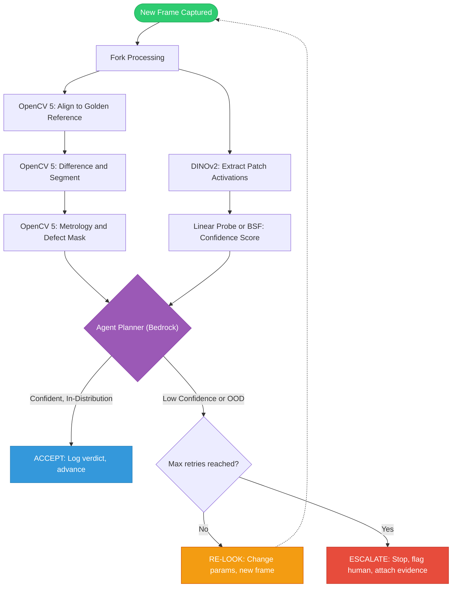
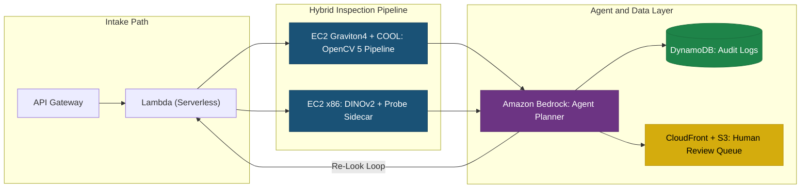
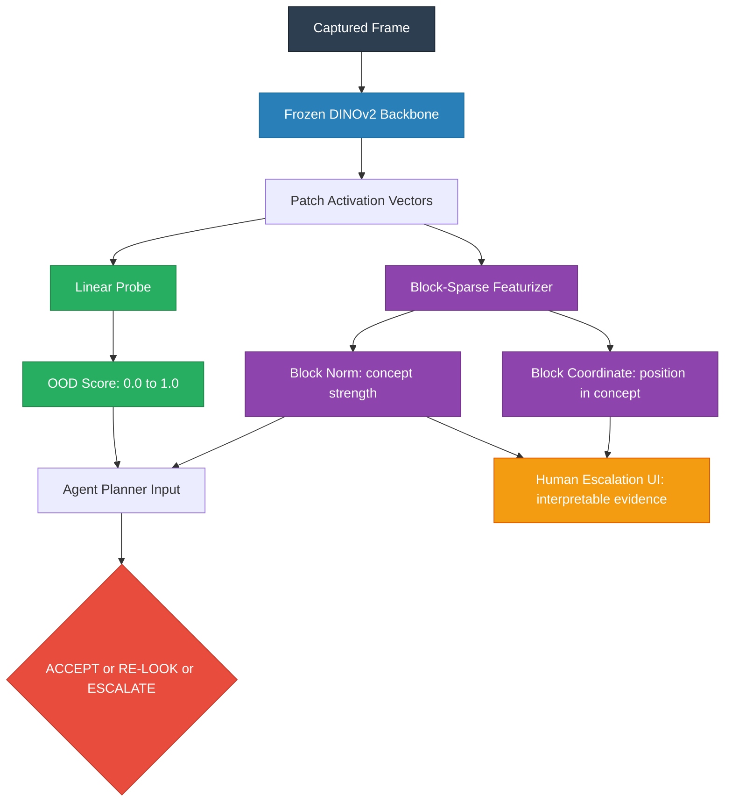

# Parallax: Technical Architecture & Real-World Example

To understand what we are building, let's walk through a concrete, real-world example of the system in action on a manufacturing line, followed by the technical flows that make it happen.

## 1. A Real-World Example: The Circuit Board Inspection

Imagine a manufacturing line producing Printed Circuit Boards (PCBs). The QA goal is to catch missing components or solder defects. 

**The Setup:**
The Parallax system is installed above the conveyor belt. It has a "golden reference" image of a perfect PCB. 

**Scenario A: The Perfect Board (In-Distribution, High Confidence)**
1. A good PCB slides under the camera.
2. **OpenCV 5 (Graviton4):** Aligns the image to the golden reference, subtracts the differences, and finds no defects.
3. **DINOv2 Sidecar (x86):** Looks at the image and says, "This looks exactly like the lighting and angles I was trained on. I am 98% confident."
4. **Agent Planner:** Sees `No Defects` + `High Confidence` -> **Action: ACCEPT**. The board moves on.

**Scenario B: The Tricky Shadow (Out-of-Distribution, Low Confidence)**
1. A PCB slides under, but a warehouse door opened, casting a harsh, unfamiliar shadow over a cluster of resistors.
2. **OpenCV 5:** The shadow causes a pixel difference. OpenCV flags it as a "Defect" because it looks different from the golden reference.
3. **DINOv2 Sidecar:** Analyzes the patch activations and realizes, "I have never seen this lighting distribution before. My confidence in this region is 30%."
4. **Agent Planner:** Sees `Defect` + `Low Confidence` -> **Action: RE-LOOK**. 
5. The Agent adjusts the camera exposure parameters (or requests a second crop at a different angle) and takes a new frame.
6. **Re-Evaluation:** The new frame removes the shadow. OpenCV finds no defects, and DINOv2 confidence is high. The board is accepted without wasting a human's time.

**Scenario C: The Unsolvable Defect (Escalation)**
1. A PCB has a weird, smeared solder paste blob that looks ambiguous. 
2. OpenCV flags it. DINOv2 confidence is extremely low because it's an edge case.
3. The Agent tries a "Re-look", but the confidence remains low.
4. **Agent Planner:** **Action: ESCALATE.**
5. **Human Operator:** Receives a ping on their dashboard. They don't just get a warning; they get the image with a bounding box drawn exactly over the smeared solder, with the BSF (Block-Sparse Featurizer) explaining *why* it's confused. The human clicks "Reject".

---

## 2. Technical User Flow (The Agentic Loop)

This diagram shows how a single frame is processed and how the agent makes decisions based on the dual-output of the system.

---

## 3. System Architecture (AWS Deployment)

We build a hybrid architecture that splits the workload between Arm (Graviton) and x86. This fulfills the "Best Use of COOL" requirement.

### Technical Breakdown

| Component | Role | Runs On |
|---|---|---|
| **The Muscle** | Homography alignment (LightGlue/ALIKED), differencing, morphological ops, contour metrology | EC2 Graviton4 + COOL |
| **The Brain** | Frozen DINOv2 inference, Linear Probe, BSF confidence scoring | EC2 x86 (GPU) |
| **The Conductor** | Takes OpenCV verdict + confidence score, decides ACCEPT / RE-LOOK / ESCALATE | Amazon Bedrock |
| **The Memory** | Replayable decision traces for every verdict | DynamoDB |
| **The Human Gate** | Escalation queue with BSF-powered visual evidence | S3 + CloudFront |

---

## 4. Technical Deep Dive: The Confidence Sidecar

The "Confidence Sidecar" is what allows the system to know *when* it is confused. It operates entirely separately from OpenCV's geometry processing. Here is exactly how it works under the hood.

### A. The Backbone: DINOv2

When a frame comes in, it is passed through a **frozen DINOv2 vision transformer**. 

- We do **not** train or fine-tune DINOv2.
- We chop the image into 14x14 pixel "patches" and extract internal activations (embeddings) from the transformer layers. 
- These activations contain rich, uncompressed representations of what's in the image.

> Think of DINOv2 as a universal feature extractor. It sees the raw pixels and converts them into a rich numerical fingerprint that captures texture, shape, edges, and structure — without being told what to look for.

### B. The Linear Probe (The Floor)

A simple linear classifier trained directly on those DINOv2 activations using our validated training data.

| Property | Detail |
|---|---|
| **Input** | DINOv2 activation vector (768-dim or 1024-dim) |
| **Output** | Single scalar: OOD likelihood score (0.0 to 1.0) |
| **Training** | Logistic regression on "good" vs "anomalous" activations from VisA |
| **Build time** | ~1 day |
| **Purpose** | Guaranteed working confidence signal from Week 2 |

**How it decides:** If the activation vector lands far from the cluster of "known good" activations in the training set, the probe returns a high OOD score. The agent interprets a high OOD score as "don't trust the OpenCV verdict."

### C. The Block-Sparse Featurizer / BSF (The Magic)

Inspired by Goodfire's work on model interpretability, we train a **Block-Sparse Featurizer (BSF)** on the same DINOv2 activations.

**SAE vs BSF — the key difference:**

| | Standard SAE | Block-Sparse Featurizer |
|---|---|---|
| Output per concept | Single activation value | A multi-dimensional **block vector** |
| What it tells you | "This concept is active" | "This concept is active **and here is where within it**" |
| For inspection | "Looks like a weld seam" | "This is the **cracked-edge region** of the weld-seam concept" |

When we run an activation through the BSF, it gives us **two** critical pieces of information per learned block:

1. **Block Norm (Magnitude):** How strongly is this concept present?
   - *Example:* "There is a 95% chance this region is a solder joint."
2. **Block Coordinate (Direction):** Where within that concept's manifold does this image sit?
   - *Example:* "Within the solder-joint concept, this vector points towards the cracked-edge region."

### D. How Probes and BSF Flow Together

### E. Why This Matters for the Competition

| Rubric Requirement | How We Hit It |
|---|---|
| **"Visual evidence must change what the system does next"** | The OOD score from the probe directly gates the agent's ACCEPT / RE-LOOK / ESCALATE decision |
| **"Failure handling, observability, human control" (15%)** | BSF block coordinates render interpretable evidence in the escalation UI; every decision is traced in DynamoDB |
| **"Appropriate autonomy" (25%)** | The agent can re-look freely but can **never** override a block — human approval is a hard gate, not a prompt suggestion |
| **"10-500x cheaper than VLM-as-judge"** | A linear probe on frozen activations costs fractions of a cent per frame vs dollars for a VLM call |
